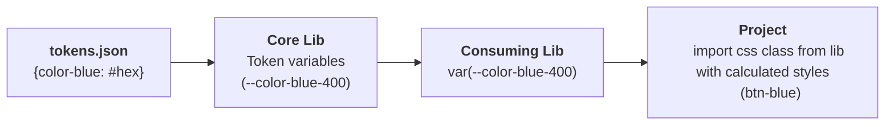
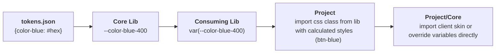

# Design System Standardisation Prototype

This repo provides a demo approach to standardising styling
across multiple projects via a central tokens library.

This project contains a dummy app under apps/demo

It also contains the core token library implemented via style dictionary

Finally it has two demo libraries (packages/component-libs/*)
1. A bootstrap 5 adapter that overrides the styles based on the tokens provided in the core token lib
2. An angular implementation of a button component with a fixed height. 

All libraries are being build with nx under assumption of a monorepo. However could be split up into different
repos if necessary

# Getting Started with Demo
```
  npm install
  ./pack-demo.ps1 // This packs and copies the tarballs to the demo app
  cd apps/demo
  npm i
  npm run start
```
Once inside the demo apps you can use the buttons on the top right to toggle between different client styles

# Design Quirks

### Base Style Flow



### Client Theme Flow



Skins are a set of variable overrides (scss) provided in the core library so multiple apps can share the same overrides

## Bootstrap Adapter
As necessary to support older designs this project provides an  way to override bootstrap styles. This is achieved through a dedicated adapter library (libs/bootstrap-lib). If a per project solution is needed it should be easy to implement the adapter in each project as well. The current design currently supports Bootstrap 5.3+, need to investigate how far back this form of css/scss support is supported in Bootstrap

### Token Layers

| Layer | Owner | Example |
|---|---|---|
| Primitives | `@your-org/core` | `--color-blue-400: #60a5fa` |
| Semantic aliases | `@your-org/core` | `--brand-primary: var(--color-blue-400)` |
| Component tokens | Component lib | `--button-bg: var(--brand-primary)` |
| Skin overrides | Project / Core skins | `--color-blue-400: #E85D24` |